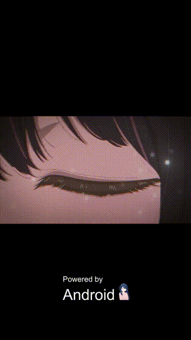
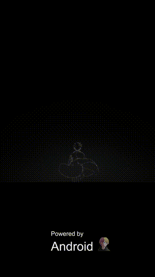

# ❤️ Oshi-no-Ko-Bootanimations
An Oshi no Ko themed startup animation for Android

<span style="color:red">(Note: the resolution of the gif is not the real one.)</span>
# 🌟 AI:



🔗[Download](https://github.com/Anto426/Oshi-no-Ko-Bootanimation/releases/download/1.0.0/AI0.zip)


# 💎 Ruby :


🔗[Download](https://github.com/Anto426/Oshi-no-Ko-Bootanimation/releases/download/1.1.0/Ruby0.zip)


# 🌊 Aqua:



🔗[Download](https://github.com/Anto426/Oshi-no-Ko-Bootanimation/releases/download/1.2.0/Aqua0.zip)

# 🔴 Kana:


🔗[Download](https://github.com/Anto426/Oshi-no-Ko-Bootanimation/releases/download/1.3.0/Kana0.zip)

# ⭐ Akane:


🔗[Download](https://github.com/Anto426/Oshi-no-Ko-Bootanimation/releases/download/1.4.0/Akane0.zip)

## 💻Magisk Module

```
Changelog

❤️Oshi no ko bootanimation v1.0.4

- updated link generation
  
❤️Oshi no ko bootanimation v1.0.3

- small module size

❤️Oshi no ko bootanimation v1.0.2

- fix bugs

❤️Oshi no ko bootanimation v1.0.1

- initial release
  
Enjoy!
```

🔗[Download](https://github.com/Anto426/Oshi-no-Ko-Bootanimations/releases/download/3.0.0/Oshi_no_ko_Bootanimations.zip)


## ✍🏻 Manual Instructions

1. Connect adb as root:

```shell
adb root
```

2. Remount partitions:

```shell
adb remount
```

3. Copy the bootanimation:

```shell
adb push "dir bootanimation" /product/media/
```
