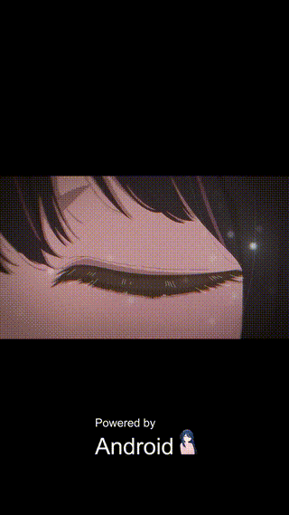
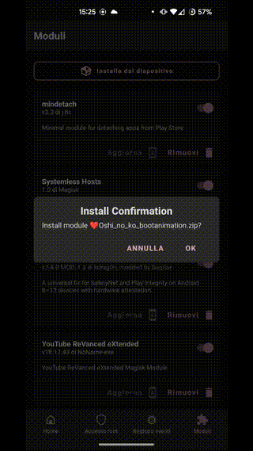

# ❤️ Oshi-no-Ko-Bootanimations

An Oshi no Ko themed startup animation for Android

<span style="color:red">(Note: the resolution of the gif is not the real one.)</span>

# 🌟AI:



# 💎 Ruby :


# 🌊 Aqua:


# 🔴 Kana:


# ⭐ Akane:


# 💛 MemCho:



## ✍🏻 Manual Instructions

1. Download your favorite boot
   
      🌟[AI](https://github.com/Anto426/Oshi-no-Ko-Bootanimation/releases/download/1.0.0/AI0.zip)
   
      💎[Ruby](https://github.com/Anto426/Oshi-no-Ko-Bootanimation/releases/download/1.1.0/Ruby0.zip)
   
      🌊[Aqua](https://github.com/Anto426/Oshi-no-Ko-Bootanimation/releases/download/1.2.0/Aqua0.zip)
   
      🔴[Kana](https://github.com/Anto426/Oshi-no-Ko-Bootanimation/releases/download/1.3.0/Kana0.zip)
   
      ⭐[Akane](https://github.com/Anto426/Oshi-no-Ko-Bootanimation/releases/download/1.3.0/Kana0.zip)
   
      💛[MemCho](https://github.com/Anto426/Oshi-no-Ko-Bootanimation/releases/download/1.5.0/MemCho0.zip)

3. Reneme file to bootanimation.zip 


3. Connect adb as root:

```shell
adb root
```

4. Remount partitions:

```shell
adb remount
```

5. Copy the bootanimation:

```shell
adb push "dir bootanimation" /product/media/
```


